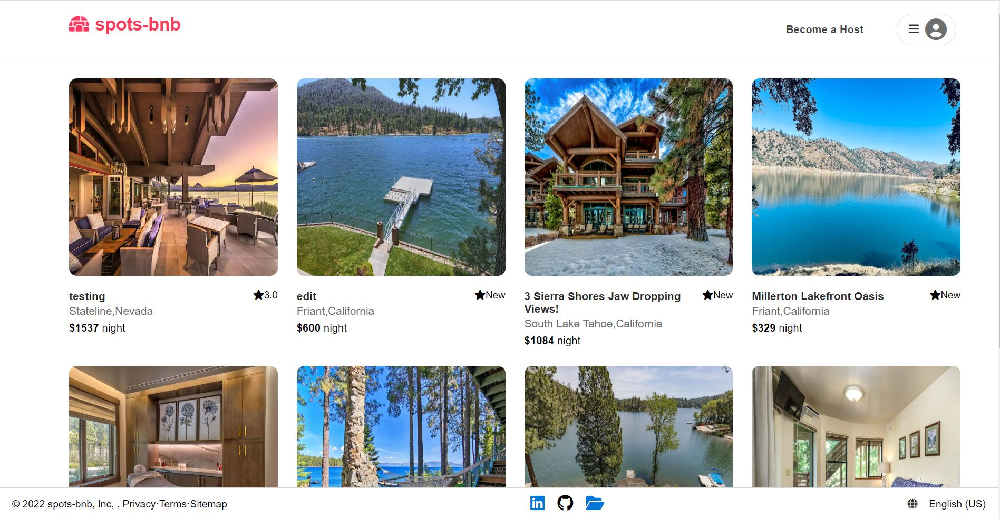
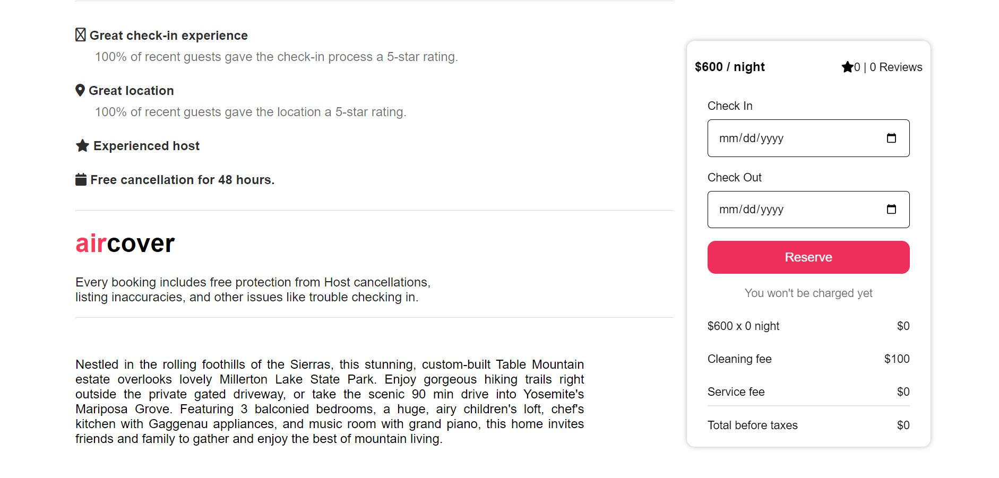
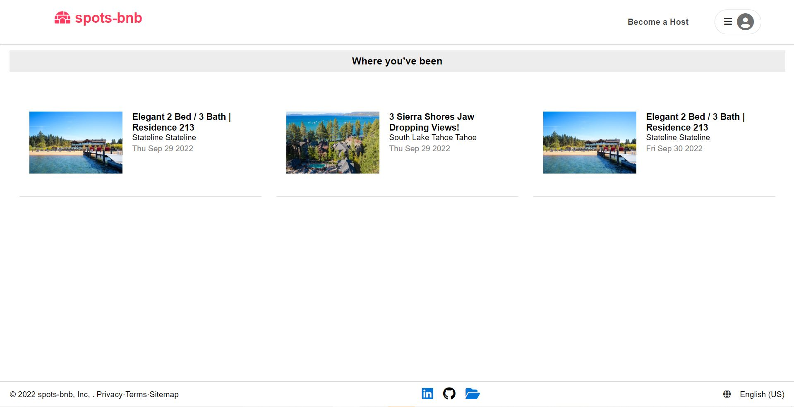
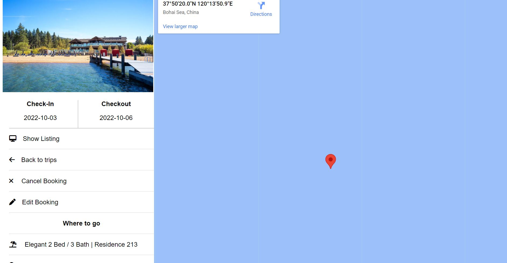
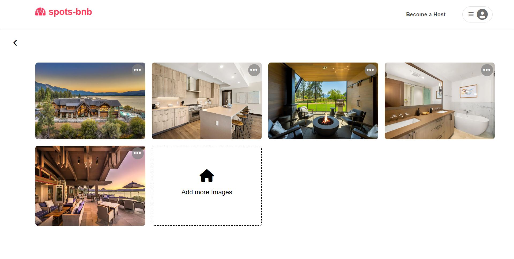

### spots-bnb

This is clone of Airbnb. As we all know, Airbnb is an online marketplace that connects people who want to rent out their homes with people who are looking for accomodations in specific locales.
In my project 'spots-bnb', I tried to replicate most of functionality of official Airbnb website and support almost all necessary features.   [Click here to view spots-bnb Live Site](https://spots-bnb.herokuapp.com/)

Please see below link to project wiki:  
 [Feature List](https://github.com/varshagade211/AirBnB/wiki/Feature-list)   
 [Database Schema](https://github.com/varshagade211/AirBnB/wiki/Database-Schema-Image-with-Relationships)   
 [API Routes](https://github.com/varshagade211/AirBnB/wiki/API-Routes)   
 [Redux Store State Shape](https://github.com/varshagade211/AirBnB/wiki/Redux-State-Shape)  

 This project is built with:  
 JavaScript  
 Sqlite3   
 Sequelize   
 Express  
 React   
 Redux  

## Feature Directions:

* Home Page Demo User:
    You will be able to test features without signup by clicking on "Demo User" button.

* Home page:

 &nbsp;  &nbsp;  &nbsp;

* Single spot:

 &nbsp;  &nbsp;  &nbsp;

 &nbsp; &nbsp; &nbsp;

* My reviews:

 &nbsp; &nbsp; &nbsp;

* Trips:

 &nbsp; &nbsp; &nbsp;

* Trips in detail:

 &nbsp; &nbsp; &nbsp;

* Change image:

 &nbsp; &nbsp; &nbsp;
